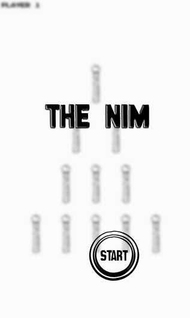
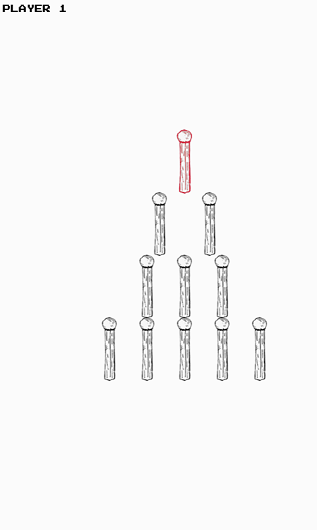

# NIM GAME

This is an android two-player mathematical game of strategy in which both players take turns removing matches from piles to win.

### How To Play - 

In one move, you can remove any number of matches but only from one row. Select any number of matches and tap again on screen to REMOVE them. You win if you are the LAST one to REMOVE matches.

### Screenshots - 

